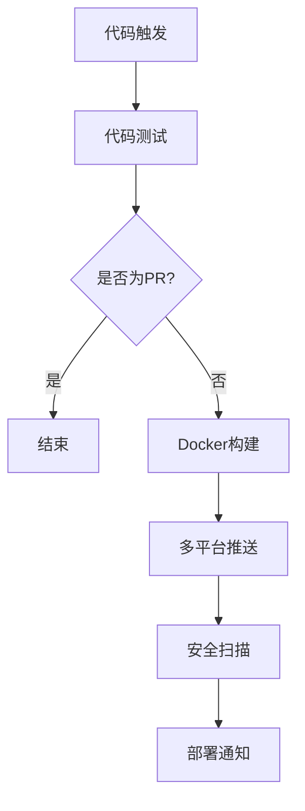

# CI/CD 配置指南

## 概述

本项目使用 GitHub Actions 进行完整的 CI/CD 流水线，包括代码测试、Docker 镜像构建、安全扫描和部署。

## 工作流架构

### 触发条件

工作流在以下情况下自动触发：

1. **代码推送**
   - `main` 分支推送
   - `develop` 分支推送
   - 任何标签推送 (`v*`)

2. **Pull Request**
   - 针对主分支的 PR

3. **手动触发**
   - 在 GitHub Actions 页面手动运行

### 工作流阶段



## 详细阶段说明

### 1. 测试阶段

#### 代码语法检查
```yaml
- Python 语法验证
- 应用程序加载测试
- 环境变量配置测试
```

#### 质量检查
- 模块导入验证
- 配置加载功能测试
- 依赖关系检查

### 2. 构建阶段

#### 多平台支持
- **linux/amd64**: 标准 x86_64 架构
- **linux/arm64**: ARM 64位架构 (Apple Silicon, AWS Graviton)

#### 构建优化
- **分层缓存**: 利用 GitHub Actions 缓存加速构建
- **并行构建**: 多平台同时构建
- **依赖优化**: 最小化镜像大小

#### 标签策略
```yaml
tags:
  - main分支: latest
  - develop分支: develop-{commit}
  - 标签推送: 版本号 (v1.0.0)
  - 自动标签: {branch}-{commit}
```

### 3. 安全扫描阶段

#### 漏洞扫描
- **Trivy**: 容器镜像漏洞扫描
- **依赖检查**: Python 包安全检查
- **配置审计**: Docker 配置安全检查

#### 结果报告
- **GitHub Security**: 自动上传到 Security 标签页
- **SARIF 格式**: 标准化漏洞报告
- **分级处理**: 高危、中危、低危分类

### 4. 部署通知阶段

#### 部署摘要
- 镜像信息
- 快速启动命令
- 平台支持信息

## 本地开发与测试

### 前置要求

```bash
# 安装 Docker Buildx
docker buildx install
docker buildx create --use

# 安装 GitHub CLI (可选)
# macOS: brew install gh
# Ubuntu: sudo apt-get install gh
```

### 本地构建测试

```bash
# 构建多平台镜像
docker buildx build \
  --platform linux/amd64,linux/arm64 \
  --tag business-gemini-pool:local \
  .

# 运行测试容器
docker run -d \
  --name gemini-test \
  -p 8000:8000 \
  -e ACCOUNTS_CONFIG='[{"team_id":"test","secure_c_ses":"test","host_c_oses":"test","csesidx":"test","available":true}]' \
  business-gemini-pool:local

# 测试健康检查
curl http://localhost:8000/health
```

### 本地推送测试

```bash
# 推送到本地 registry
docker buildx build \
  --platform linux/amd64,linux/arm64 \
  --push \
  --tag localhost:5000/business-gemini-pool:test \
  .
```

## 环境配置

### 开发环境

```yaml
# .github/workflows/docker-build.yml
env:
  REGISTRY: ghcr.io
  IMAGE_NAME: ${{ github.repository }}
```

### 生产环境配置

1. **权限设置**
```yaml
permissions:
  contents: read
  packages: write
  security-events: write
```

2. **环境变量**
```yaml
# 构建参数
BUILD_DATE: ${{ github.event.head_commit.timestamp }}
VCS_REF: ${{ github.sha }}
VERSION: ${{ steps.meta.outputs.version }}
```

## 故障排除

### 常见问题

#### 1. 多平台构建失败

**问题**: ARM 平台构建失败
```bash
Error: multiple platforms feature is currently not supported
```

**解决方案**:
```bash
# 启用 Docker Buildx
docker buildx install
docker buildx create --use
docker buildx inspect --bootstrap
```

#### 2. 权限不足

**问题**: 推送到 Container Registry 失败
```bash
Error: denied: permission to create repository
```

**解决方案**:
1. 检查仓库权限设置
2. 确保 `GITHUB_TOKEN` 有 `packages: write` 权限
3. 对于私有仓库，联系组织管理员

#### 3. 缓存问题

**问题**: 构建缓存失效
```bash
Error: failed to cache: cache not found
```

**解决方案**:
```yaml
# 在 workflow 中配置缓存
cache-from: type=gha
cache-to: type=gha,mode=max
```

#### 4. 安全扫描超时

**问题**: Trivy 扫描超时
```bash
Error: timeout waiting for scan to complete
```

**解决方案**:
```yaml
# 增加超时时间
- name: Run Trivy vulnerability scanner
  uses: aquasecurity/trivy-action@master
  with:
    image-ref: ${{ env.REGISTRY }}/${{ env.IMAGE_NAME }}:latest
    timeout: 600  # 10分钟
```

### 调试技巧

#### 1. 启用详细日志

```yaml
- name: Enable debug logging
  run: |
    echo "::set-output name=docker_debug::true"
    echo "::set-output name=buildkit_debug::1"
```

#### 2. 查看构建日志

```bash
# GitHub CLI
gh run view --log
gh run list --workflow=docker-build.yml

# Web 界面
# https://github.com/your-repo/actions
```

#### 3. 本地调试

```bash
# 导出构建环境
docker buildx build \
  --platform linux/amd64 \
  --output type=local,dest=./build-output \
  .

# 检查构建产物
ls -la build-output/
```

## 性能优化

### 构建优化

#### 1. 分层策略
```dockerfile
# 基础层 - 变化频率低
FROM python:3.11-slim AS base

# 依赖层 - 仅在 requirements.txt 变化时重建
COPY requirements.txt ./
RUN pip install -r requirements.txt

# 应用层 - 代码变化时重建
COPY . .
```

#### 2. 缓存配置
```yaml
# GitHub Actions 缓存
- uses: actions/cache@v3
  with:
    path: ~/.cache/pip
    key: ${{ runner.os }}-pip-${{ hashFiles('**/requirements.txt') }}
```

#### 3. 并行构建
```yaml
# 多平台并行构建
strategy:
  matrix:
    platform: [linux/amd64, linux/arm64]
```

### 运行时优化

#### 1. 镜像大小优化
```dockerfile
# 多阶段构建
FROM python:3.11-slim AS builder
# ... 构建逻辑 ...

FROM python:3.11-slim AS runtime
COPY --from=builder /app /app
```

#### 2. 资源限制
```yaml
# 容器资源限制
resources:
  requests:
    memory: "256Mi"
    cpu: "250m"
  limits:
    memory: "512Mi"
    cpu: "500m"
```

## 监控和告警

### 构建监控

#### 1. 成功率监控
```yaml
# 构建状态 webhook
- name: Notify build status
  uses: 8398a7/action-slack@v3
  with:
    status: ${{ job.status }}
    channel: '#ci-cd'
```

#### 2. 性能指标
```yaml
# 构建时间统计
- name: Build metrics
  run: |
    echo "Build time: ${{ steps.build.outputs.duration }}"
    echo "Image size: ${{ steps.image.outputs.size }}"
```

### 安全监控

#### 1. 漏洞告警
```yaml
# 高危漏洞自动告警
- name: Security alert
  if: contains(steps.security.outputs.vulnerabilities, 'HIGH')
  uses: 8398a7/action-slack@v3
  with:
    text: "🚨 High severity vulnerabilities found!"
```

#### 2. 合规检查
```yaml
# 镜像合规性检查
- name: Compliance check
  run: |
    # 检查镜像是否符合企业安全标准
    compliance-scan --image ${{ env.REGISTRY }}/${{ env.IMAGE_NAME }}:latest
```

## 最佳实践

### 1. 版本管理
- 使用语义化版本标签
- 保持 `latest` 标签与主分支同步
- 重要版本创建 Git Tag

### 2. 安全实践
- 定期更新基础镜像
- 扫描第三方依赖
- 使用最小权限原则

### 3. 性能实践
- 优化 Dockerfile 层顺序
- 使用多阶段构建减少镜像大小
- 启用并行构建加速

### 4. 可维护性
- 详细的构建日志
- 清晰的错误消息
- 完善的文档和注释

## 相关链接

- [GitHub Actions 官方文档](https://docs.github.com/en/actions)
- [Docker Buildx 文档](https://docs.docker.com/buildx/)
- [GitHub Container Registry](https://docs.github.com/en/packages/working-with-a-github-packages-registry/working-with-the-container-registry)
- [Trivy 安全扫描](https://github.com/aquasecurity/trivy)
- [Open Container Initiative](https://opencontainers.org/)